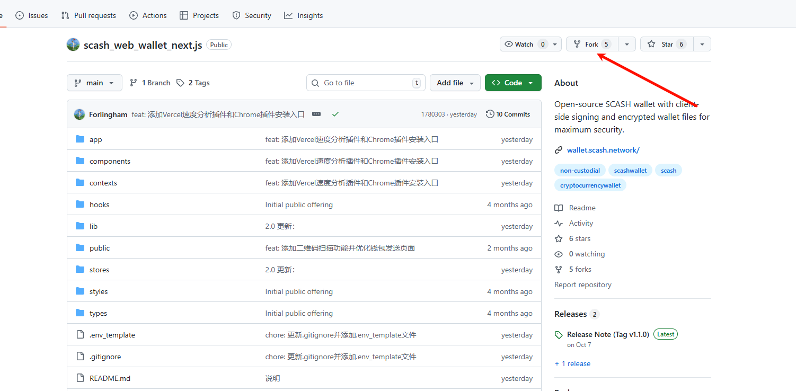
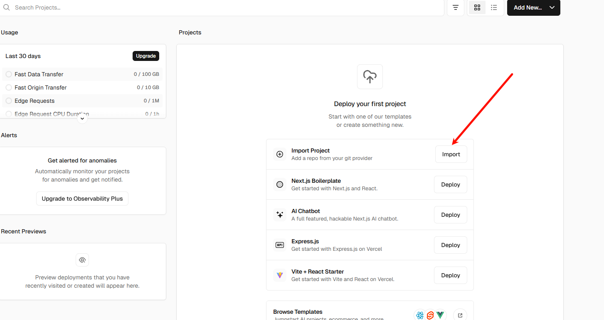
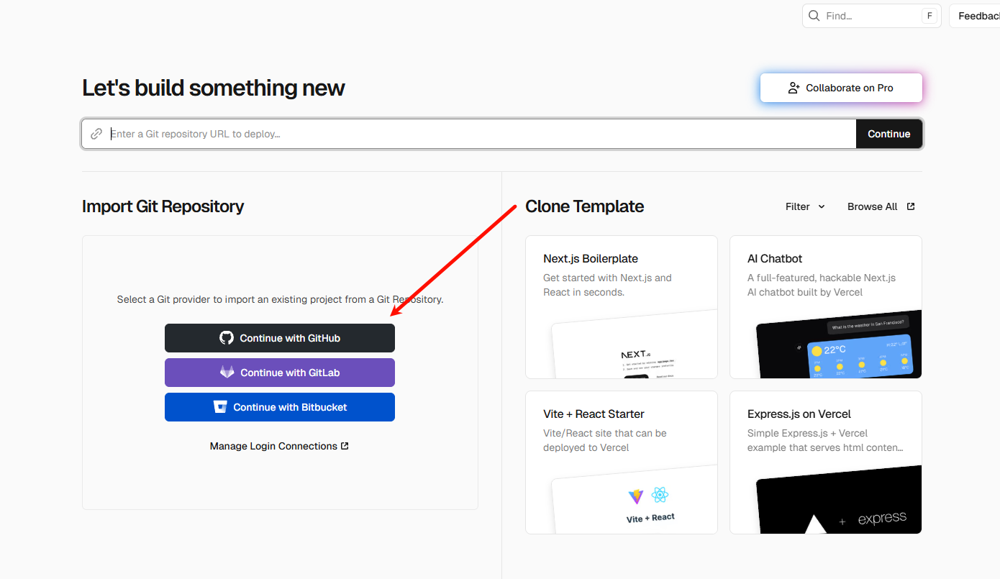
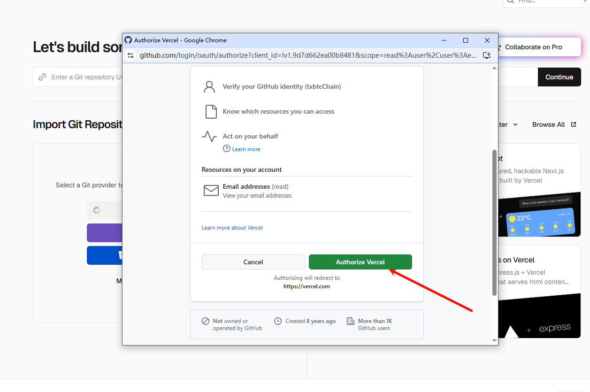
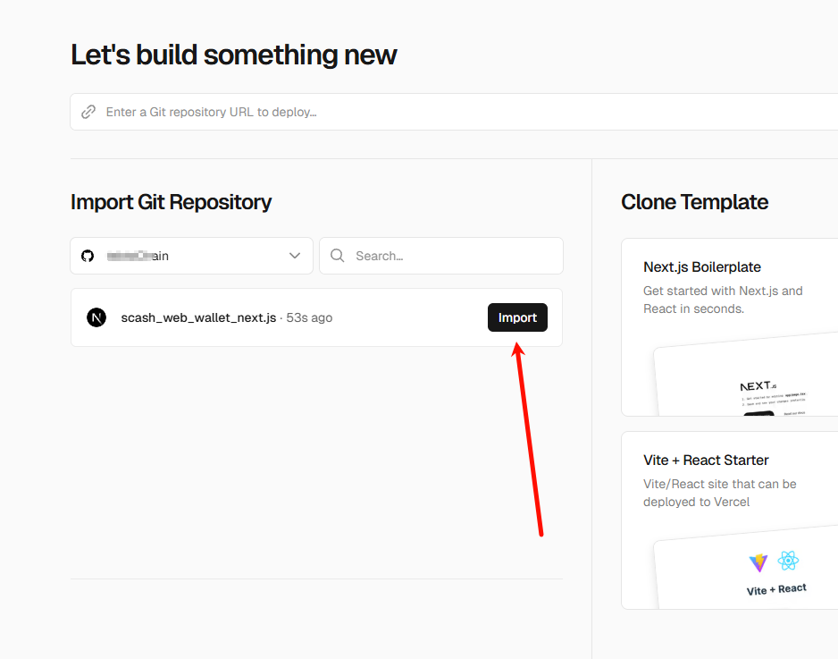
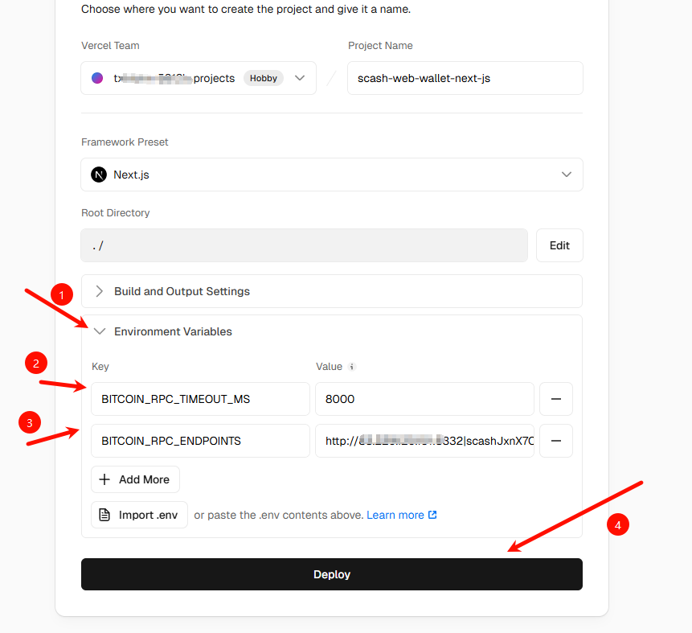
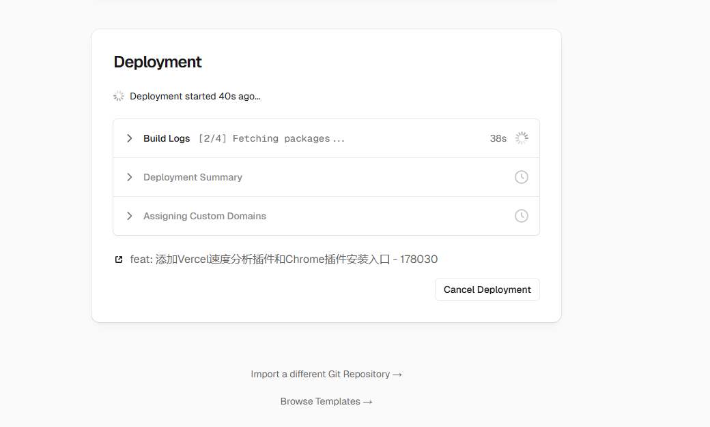
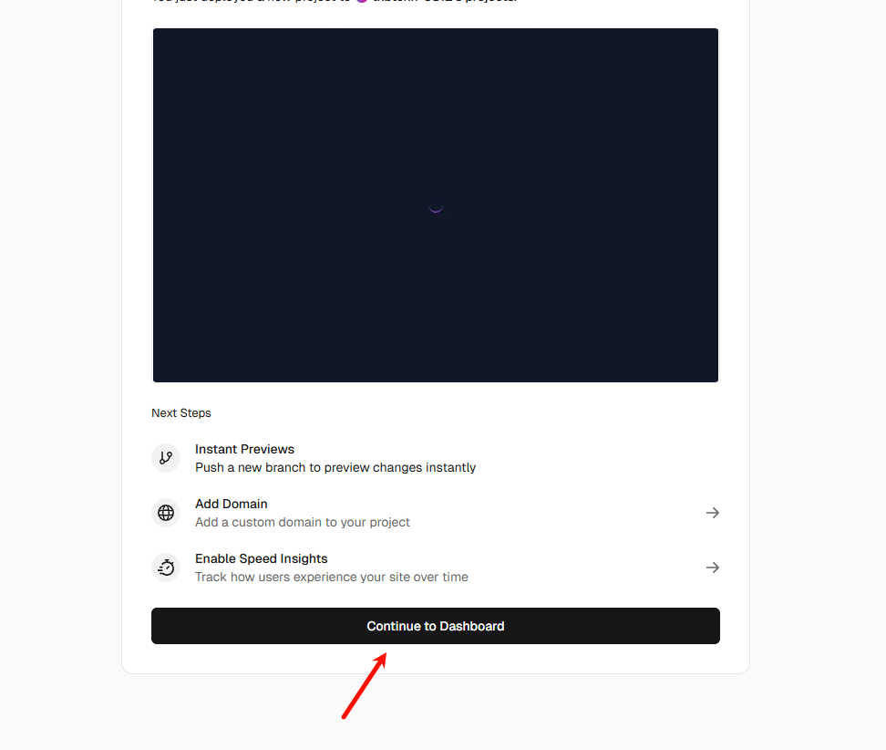
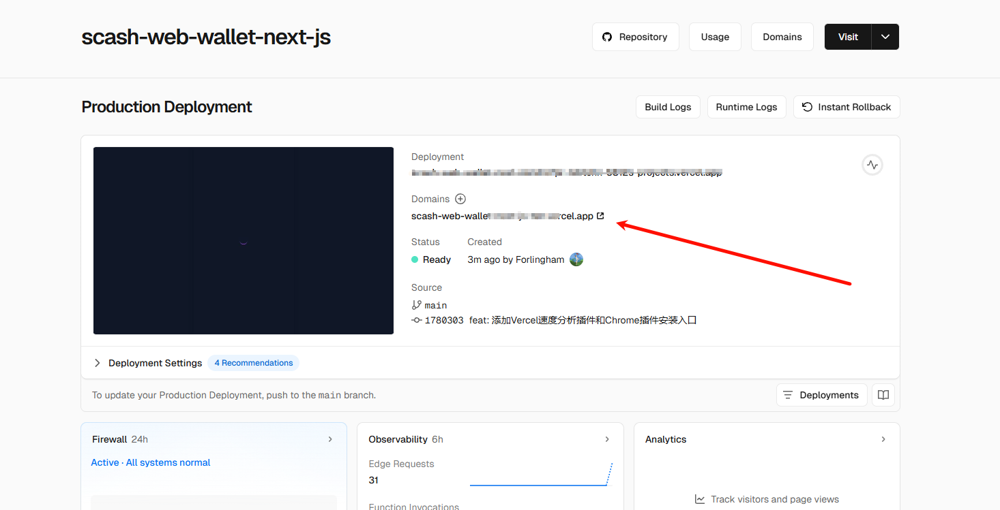

# 保姆级教程：手把手教你部署 SCASH 网页钱包

不需要懂代码，只需要跟着图片一步步点鼠标，就能拥有自己的 SCASH 钱包网站。

## 准备工作
* 一个 GitHub 账号（用于存放代码）
* 一个 Vercel 账号（用于免费建站）
* 准备好你的RPC节点信息（IP、端口、账号、密码）

---

## 第一步：把代码“搬”到你家 (Fork)

1.  登录你的 GitHub 账号，然后打开官方开源仓库链接：
    `https://github.com/Forlingham/scash_web_wallet_next.js`

2.  找到页面右上角的 **Fork** 按钮，点击它。这一步是把代码复制一份到你的账号下。

3.  在弹出的页面直接点绿色的 **Create fork**。稍等几秒，页面会自动跳转，当你看到左上角是你的用户名时，说明代码“搬运”成功了。

---

## 第二步：登录 Vercel 导入项目

1.  打开 [Vercel 官网](https://vercel.com/) 并登录。

2.  在控制台首页，点击 **Add New ...** 然后选择 **Project**（或者直接点中间的 Import Project）。

3.  在左侧选择 **Continue with GitHub**。

1.  如果是第一次用，会弹出一个授权框，点击绿色的 **Authorize Vercel**。

2.  授权完成后，你能在列表里看到刚才 Fork 的 `scash_web_wallet_next.js` 项目。点击右侧黑色的 **Import** 按钮。

---

## 第三步：填写关键配置 (最重要的一步！)

进入配置页面后，**不要动其他的设置**，只需要展开 **Environment Variables (环境变量)** 这一栏。我们需要添加两行“暗号”。

**1. 添加第一行变量（超时设置）：**
* **Key (左边填)**: `BITCOIN_RPC_TIMEOUT_MS`
* **Value (右边填)**: `8000`
* 填好后点 Add。

**2. 添加第二行变量（节点信息）：**
* **Key (左边填)**: `BITCOIN_RPC_ENDPOINTS`
* **Value (右边填)**: `http://IP地址:端口|用户名|密码`
    * *注意：中间的竖线 `|` 是分隔符，千万不要加空格！*

**3. 开始部署：**
确认两行变量都添加进去后，点击页面最底部的 **Deploy** 按钮。

---

## 第四步：等待并访问

1.  点击部署后，会进入加载页面，这时候只要耐心等待（大约 1 分钟）。

1.  当屏幕上出现“Congratulations!”或者显示出网页预览图时，说明成功了！点击 **Continue to Dashboard**。

2.  在项目主页，点击 **Domains** 下面那个以 `.vercel.app` 结尾的链接。

3.  恭喜！你现在应该能看到钱包的紫色界面了。

---

### 💡 常见问题小贴士
#### Q1: 官方代码更新了，我如何更新我的钱包？
由于您是 Fork 的代码，官方更新不会自动同步到您的部署。更新步骤如下：
1.  回到您的 GitHub 仓库页面。
2.  在代码文件列表上方，点击 **Sync fork** -> **Update branch**。
3.  GitHub 会自动同步最新代码。
4.  **Vercel 会自动检测到代码变化并触发重新部署**。您只需等待几分钟，刷新您的钱包网页即可看到最新版本。

#### Q2: 钱包显示连接错误或余额加载不出来？
这通常是 RPC 配置问题。请按以下步骤排查：
1.  99% 是因为**第三步**里的节点信息填错了。
  **检查方法**：去 Vercel 的 Settings -> Environment Variables 里检查，看看 `http://` 有没有漏掉，或者竖线 `|` 前后是不是不小心加了空格。修改后记得去 Deployments 页面点 Redeploy (重新部署) 才会生效。

2.  检查 `BITCOIN_RPC_ENDPOINTS` 的值。
    * 确认 IP 和端口是否公网可访问（如果 Vercel 无法连接您的家庭宽带 IP，需要配置内网穿透或使用云服务器）。
    * 再次确认 URL、用户名、密码之间没有多余的空格。
    * 修改后，需要去 **Deployments** 页面，点击最近一次部署右侧的三个点，选择 **Redeploy** 才能生效。

